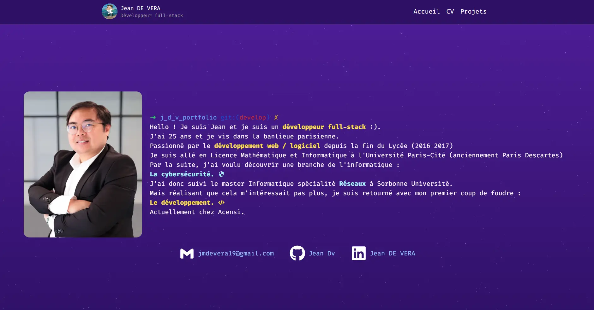

# 🌐 My Developer Portfolio

Hello ! I'm Jean and welcome to my personal developer portfolio — a sleek and modern website built with [Next.js](https://nextjs.org/). This site showcases my background, skills, and projects as a full-stack developer.

## 🚀 Features

- ⚡ Built with Next.js 13+ (App Router)
- 💅 Styled using Tailwind CSS
- 🧩 Modular and reusable components with heroUI
- 🧠 Dynamic project listing with categories/tags
- ✨ French / English (SOON)
- 📄 Downloadable resume (SOON)

## 🖥️ Demo

👉 [Live Demo](https://jeandevera.fr)



## 🛠️ Tech Stack

- **Framework**: Next.js 13+ (App Router)
- **Styling**: Tailwind CSS
- **Animations**: aos (Animate on scroll), React Starfield
- **Deployment**: Netlify
- **Other Tools**: ESLint, Prettier (optional)

## ⚙️ Getting Started
**Prerequisites**
Ensure you have the following installed:

- Node.js (18.x or higher recommended)
- npm / yarn / pnpm

**Installation**
1. Clone the repository
```bash
git clone https://github.com/JMarcDv/jaym-portfolio.git
cd jaym-portfolio
```

2. Install dependencies
```bash
npm install
```

3. Start the development server
```bash
npm run dev
Open your browser and visit: http://localhost:3000
```

4. Open your browser and visit: http://localhost:3000

## 🧑‍💻 Contact

Feel free to connect with me!

- 📧 Email: jmdevera19@gmail.com
- 💼 [LinkedIn](https://linkedin.com/in/jean-de-vera)